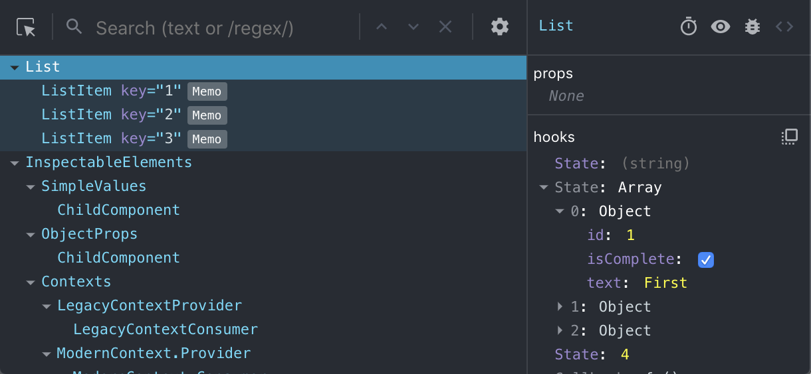

Nós estamos animados em anunciar uma nova versão do React Developer Tools, disponível hoje para Chrome, Firefox e (Chromium) Edge!

## O que mudou? {#whats-changed}

Muito mudou na versão 4!
Resumidamente, esta nova versão deve oferecer ganhos significantes de performance e uma experiência de navegação melhorada.
Ela também oferece suporte completo para React Hooks, incluindo a possibilidade de inspecionar objetos aninhados.



[Visite o tutorial interativo](https://react-devtools-tutorial.now.sh/) para testar a nova versão ou [veja o changelog](https://github.com/facebook/react/blob/main/packages/react-devtools/CHANGELOG.md#400-august-15-2019) para vídeos de demonstração e mais detalhes.

## Quais versões do React são suportadas? {#which-versions-of-react-are-supported}

**`react-dom`**

* `0`-`14.x`: Não suportada
* `15.x`: Suportada (exceto para a nova funcionalidade de filtro de componentes)
* `16.x`: Suportada

**`react-native`**
* `0`-`0.61.x`: Não suportada
* `0.62`: Suportada

## Como eu consigo o novo DevTools? {#how-do-i-get-the-new-devtools}

O React DevTools está disponível como uma extensão para [Chrome](https://chrome.google.com/webstore/detail/react-developer-tools/fmkadmapgofadopljbjfkapdkoienihi?hl=en) e [Firefox](https://addons.mozilla.org/en-US/firefox/addon/react-devtools/).
Se você já instalou a extensão, ela deve atualizar automaticamente nas próximas horas.

Se você usa a versão independente (por exemplo, no React Native ou Safari), você pode instalar a nova versão [a partir do NPM](https://www.npmjs.com/package/react-devtools):

```shell
npm install -g react-devtools@^4
```

## Para onde foram todos os elementos do DOM? {#where-did-all-of-the-dom-elements-go}

O novo DevTools provê uma maneira de filtrar os componentes da árvore para facilitar a navegação de hierarquias profundamente aninhadas.
Host nodes (por exemplo, HTML `<div>`, React Native `<View>`) são *escondidos por padrão*, mas este filtro pode ser desabilitado:


## Como eu volto para a versão antiga? {#how-do-i-get-the-old-version-back}

Se você está trabalhando com React Native na versão 60 (ou anterior), você pode instalar a versão anterior do DevTools a partir do NPM:

```shell
npm install --dev react-devtools@^3
```

Para versões anteriores do React DOM (v0.14 ou anterior) você precisará fazer o build da extensão a partir do código fonte:

```shell
# Faça checkout do código da extensão
git clone https://github.com/facebook/react-devtools

cd react-devtools

# Faça checkout do branch da versão anterior
git checkout v3

# Instale as dependências e faça o build da extensão descompactada
yarn install
yarn build:extension

# Siga as instruções da tela para finalizar a instalação
```

## Muito obrigado! {#thank-you}

Nós gostaríamos de agradecer quem testou a versão antecipada do DevTools versão 4.
Seus feedbacks ajudaram a melhorar significativamente a versão inicial.

Nós ainda temos muitas funcionalidades excitantes planejadas e feedbacks são muito bem-vindos!
Sinta-se a vontada para abrir uma [issue no GitHub](https://github.com/facebook/react/issues/new?labels=Component:%20Developer%20Tools) ou marcar [@reactjs no Twitter](https://twitter.com/reactjs).